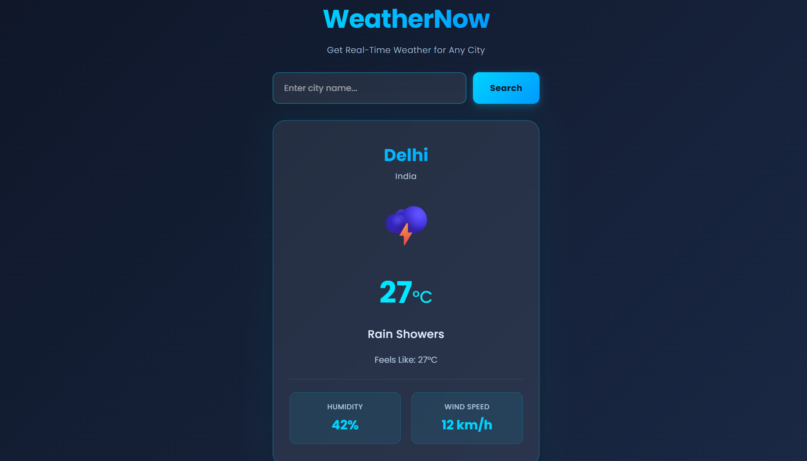

# 🌤️ WeatherNow — Live Weather App

A clean, modern weather app built with pure HTML, CSS, and JavaScript. Search any city in the world and get live, real-time weather data — no API key required.

---

## 🚀 Live Demo

> Coming soon — will be hosted on GitHub Pages

---



preview.png

---

## ✨ Features

- 🔍 Search weather by any city name
- 🌡️ Current temperature & feels like temperature
- 💧 Humidity percentage
- 🌬️ Wind speed in km/h
- ⛅ Weather condition with emoji
- 🌍 Shows country name alongside city
- ⏳ Loading spinner while fetching data
- ❌ Error handling for invalid city names
- 🎨 Smooth fade-in animation on result
- 📱 Fully responsive — works on mobile and desktop

---

## 🛠️ Tech Stack

| Technology | Usage |
|------------|-------|
| HTML5 | Structure |
| CSS3 | Styling & Animations |
| JavaScript (Vanilla) | Logic & API Calls |
| Open-Meteo Geocoding API | City → Coordinates |
| Open-Meteo Weather API | Live Weather Data |

---

## 🌐 APIs Used

This project uses **Open-Meteo** — a free, open-source weather API that requires **no API key**.

### 1. Geocoding API
Converts a city name into latitude and longitude coordinates.
```
https://geocoding-api.open-meteo.com/v1/search?name={CITY}&count=1&language=en&format=json
```

### 2. Weather Forecast API
Fetches real-time weather data using coordinates.
```
https://api.open-meteo.com/v1/forecast?latitude={LAT}&longitude={LON}&current=temperature_2m,relative_humidity_2m,wind_speed_10m,weather_code,apparent_temperature&timezone=auto
```

> 📌 No API key needed. No sign-up required. Completely free.

---

## 📁 Project Structure

```
weathernow/
│
├── index.html        # Complete app — HTML + CSS + JS in one file
└── README.md         # Project documentation
```

---

## ⚙️ How to Run Locally

1. **Clone the repository**
```bash
git clone https://github.com/minajuddin0510/weather.git
```

2. **Navigate into the folder**
```bash
cd weathernow
```

3. **Open the file in your browser**
```bash
# Simply open index.html in any browser
# Or use VS Code Live Server extension
```

No installation. No dependencies. No build steps. Just open and use. ✅

---

## 🧠 How It Works

```
User types city name
        ↓
Geocoding API converts city → lat/lon
        ↓
Weather API fetches data using lat/lon
        ↓
Weather code mapped to condition + emoji
        ↓
Result displayed with animation
```

---

## 🗺️ Weather Code Reference

| Code | Condition | Emoji |
|------|-----------|-------|
| 0 | Clear Sky | ☀️ |
| 1, 2, 3 | Partly Cloudy | ⛅ |
| 45, 48 | Foggy | 🌫️ |
| 51, 53, 55 | Drizzle | 🌦️ |
| 61, 63, 65 | Rainy | 🌧️ |
| 71, 73, 75 | Snowy | ❄️ |
| 80, 81, 82 | Rain Showers | 🌩️ |
| 95 | Thunderstorm | ⛈️ |

---

## 🙋‍♂️ Author

**Minaj Uddin**

- 🌐 GitHub: [@minajuddin](https://github.com/minajuddin0510)
- 💼 Founder of [CraftSite Studio](https://github.com/minajuddin0510)

> This is a hobby project built to strengthen my web development skills and GitHub portfolio.

---

## 📄 License

This project is open source and available under the [MIT License](LICENSE).

---

## 🌟 Show Your Support

If you liked this project, consider giving it a ⭐ on GitHub — it means a lot!

---

_Built with ❤️ by Minaj Uddin_
